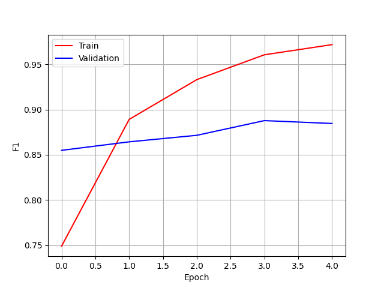
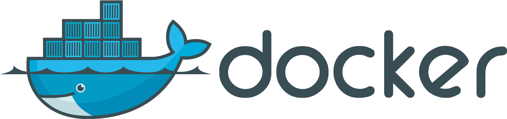

# 🗂 논문 분류기 모델
## ⚖️정의
BERT 기반으로 텍스트 불류기 모델이다.
## ▶설치
### 📥리포지터리 다운로드 받기
깃허브에서 로그인 한 후 다음 명령으로 리포지토리를 내려받으면 된다.
```
git clone https://github.com/Saltlux1/snuh.git
```
### 📝필요한 디펜던시 설치
```
pip install -r requirements.txt
```
### 📲가중치 내려받기
예측하고 싶으면 가중치를 구글 드라이브에서 내려 받으면 된다. 모델 가중치를 내려바드려면 프로젝트 폴더에 이동하고 다음과 같은 명령을 적어야 한다.
```
python download_model.py
```
### 💽테스팅 데이터테
서울대 레이블 데이터를 받지 못 해서 비슷한 텍스트 분류 작업의 데이터셋으로 개발하고 테스팅하고 있다. 데이터셋은 ./data/dataset.csv이고 세미나 5개의 공뷰터공학 논문 여 2500개가 있다.
<table>
 <tr>
   <td><b>세미나</b></td>
   <td><b>논문 수</b></td>
   <td><b>백분율</b></td>
 </tr>
 <tr>
   <td><b>VLDB</b></td>
   <td>423</td>
   <td>16.87%</td>
 </tr>
 <tr>
   <td><b>ISCAS</b></td>
   <td>864</td>
   <td>34.46%</td>
 </tr>
 <tr>
   <td><b>SIGGRAPH</b></td>
   <td>326</td>
   <td>13.003%</td>
 </tr>
 <tr>
   <td><b>INFOCOM</b></td>
   <td><b>515</b></td>
   <td><b>20.54%</b></td>
 </tr>
 <tr>
   <td><b>WWW</b></td>
   <td><b>379</b></td>
   <td><b>15.11%</b></td>
 </tr>
</table>

### 👩‍💻학습
```
python model.py
```
#### 💉실험 및 결과
</img><br/>
<b>이용한 사전학습 모델:</b> allenai-specter<br/>
<b>학습 에포크:</b> 5
<table>
 <tr>
  <td>
  </td>
  <td>
   <b>Train</b>
  </td>
  <td>
   <b>Validation</b>
  </td>
 </tr>
 <tr>
  <td>
   <b>F1 (Weighted)</b>
  </td>
  <td>
   97.27%
  </td>
  <td>
   88.12%
  </td>
 </tr>
</table>


### 🧧예측
```
python predict.py
```
### </img>에서 실행하기
<ol type>
 <li>명령 프롭트를 관리자 모드로 싱행하기.</li>
 <li>명령 프롭트에서 프로젝트 폴도로 이동.</li>
 <li>도커 이미지 빌드.</li>
 
 ```
 docker build -t snuh .
 ```
 
 <li>도커 보륨 만들기.</li>
 
 ```
 docker volume create snu
 ```
 
 <li>도커 컨테이너 실행하기.</li>
 
 ```
 docker build run --name snu -v snu:/classification_model snuh
 ```
</ol>


### 🚥리포지토리 접속 허가
이 리포지토리 다른 사람을 초대하고 싶으면 깃허브 아이디를 alvaro@saltlux.com으로 보내주세요!.
